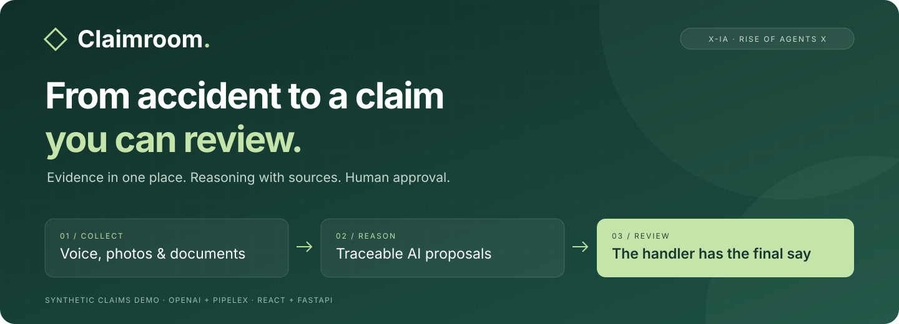
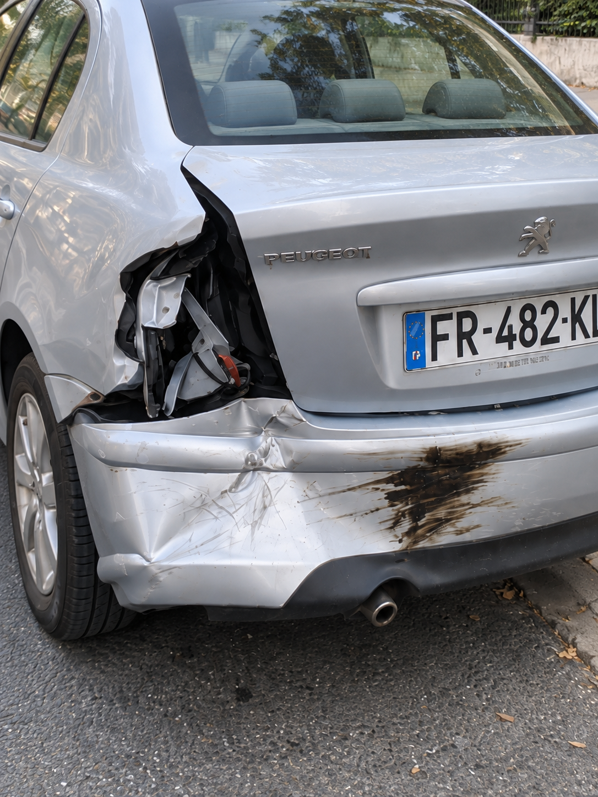
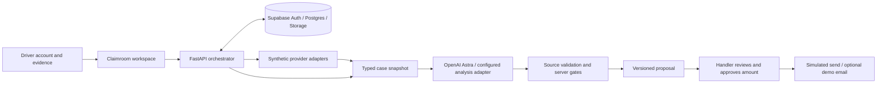

<p align="center">
  
</p>

<p align="center">
  <strong>An AI-assisted workspace for cross-border motor claims.</strong><br />
  Turn a driver's account and supporting evidence into a sourced proposal a claims handler can review.
</p>

<p align="center">
  
  
  
  
</p>

<p align="center">
  <a href="#-try-the-live-demo"><strong>Try the live demo</strong></a> ·
  <a href="#-live-end-to-end-walkthrough">Jury walkthrough</a> ·
  <a href="#-how-it-works">Architecture</a>
</p>

---

## Why Claimroom?

After an accident, the useful information is scattered: a phone call, damage photos, a short video, a repair quote, and an uncertain third-party identity. A handler has to assemble those pieces before deciding whether a recovery claim can move forward.

**Claimroom brings that investigation into one reviewable case.** Its connected workflow collects a declaration, links evidence, runs live AI analysis on the photos and timestamped video frames, highlights missing or conflicting information, and proposes a source-backed assessment and repair estimate. Server checks and a human decision control what happens next.

| For the driver | For the claims handler | For the reviewer |
| --- | --- | --- |
| Describe the accident and provide supporting files. | Inspect the narrative, evidence, estimate, and proposed recipient together. | Follow sources, inspect uncertainty, and approve an exact draft version. |

The prototype targets French motor claims involving a foreign vehicle. All bundled people, claims, insurance records, and accident media are fictional. Operational time savings have not yet been measured.

## 🚀 Try the live demo

**Open [Claimroom](https://claimroom-demo-web.vercel.app) to test the complete journey: phone call → private SMS link → photos → live video analysis → handler review → notifications.**

Use the handler credentials and demonstration phone number supplied in the private jury invitation. No installation or personal API key is needed for the hosted application.

**Photo and video analysis runs live.** OpenAI Astra compares the submitted photos with timestamped frames from the demonstration video catalogue, identifies a matching scene when the evidence supports it, and produces a sourced assessment of vehicles, damage, and possible responsibility. The photos and videos are synthetic test material; their content is analyzed by the model during the connected workflow. The repair estimate and responsibility assessment remain subject to human review.

## 🎬 Live end-to-end walkthrough

Download the two G1 photos before calling: [vehicle overview](https://raw.githubusercontent.com/Gregoirecazier/claimroom/main/apps/api/claim_api/fixture_media/g1/photo-ensemble.png) and [damage close-up](https://raw.githubusercontent.com/Gregoirecazier/claimroom/main/apps/api/claim_api/fixture_media/g1/photo-detail.png). Save them to the phone you will use for the test.

| Step | What to do | Expected result |
| --- | --- | --- |
| **1 · Call** | Call the number in the jury invitation from a French mobile with caller ID enabled. Describe the fictional G1 accident and give a name and location. | The voice agent collects the declaration and asks for missing core details. |
| **2 · Open the SMS** | After the call, open the private deposit link received by SMS. | A chat linked to your new case; no handler login is needed on the driver's phone. |
| **3 · Complete and upload** | Answer the remaining questions and attach both G1 photos. | The files are saved to the case and queued for live analysis. Keep the SMS link to return to the conversation. |
| **4 · Inspect the analysis** | Sign in to [the handler workspace](https://claimroom-demo-web.vercel.app), open the case matching the name used in the call, and select **Analyse et décision**. | A live assessment with the associated video, source references, vehicle information, and a repair estimate. Processing may take a few minutes; a pending result stays visible. |
| **5 · Review** | Read the findings and repair breakdown. Keep or change **Montant retenu (€)**, provide a reason when requested, and click **Valider le montant**. | Your decision is recorded against the current proposal. Unresolved or contradictory evidence may require more information first. |
| **6 · Send** | Inspect the displayed recipients and click **Envoyer le SMS et l’email** when that action is available. | The caller receives the follow-up SMS; the insurer email goes to the configured demonstration inbox. Delivery status appears in the case. |

Each new phone call creates its own case. Use the name given during the call to find yours. If the upload or analysis needs more information, answer in the private chat; the model's output and amounts can vary with the evidence. The video catalogue is already on the server, so no video upload is required for the G1 walkthrough.

The hosted environment can deliver real SMS and demo email. A local or separately configured deployment can instead show **simulation** on its send controls and status.

## 💻 Optional local UI preview

**Explore the interface locally without an account, API key, Python, or database.** Use the hosted journey above to exercise the live voice and AI services.

Install **Git, Node.js 20+, and npm**, then paste this into a terminal:

```sh
git clone https://github.com/Gregoirecazier/claimroom.git
cd claimroom/apps/web
npm ci
npm run demo
```

Open **[http://127.0.0.1:5180](http://127.0.0.1:5180)**. You should see four fictional cases, already signed in as a demo handler. The interface is in French; the walkthrough below uses the exact button labels.

Already have the repository? Run `npm ci` and `npm run demo` from `apps/web`.

> [!NOTE]
> **`npm run demo` is an offline UI preview.** Its prepared examples let you explore the screens without calling the live services. Added files remain in your browser. Use the hosted application above for live voice, photo/video analysis, and notifications. Click **Réinitialiser les exemples** in the bottom banner to reset the cases and local files; stop the server with `Ctrl+C`.

### Evidence you can inspect immediately

<table>
  <tr>
    <td width="50%"></td>
    <td width="50%"></td>
  </tr>
  <tr>
    <td align="center"><strong>01 · The wider context</strong><br />Locate the damage on the insured vehicle.</td>
    <td align="center"><strong>02 · The supporting detail</strong><br />Inspect the damaged area alongside the account.</td>
  </tr>
</table>

These are the actual synthetic photos bundled with G1. The case also includes a short [MP4](apps/api/claim_api/fixture_media/g1/video-g1.mp4) and a [demo repair quote](apps/web/demo/devis-demo.pdf). [Media provenance →](apps/api/claim_api/fixture_media/g1/README.md)

### Explore the local preview

Start at the case list in the local preview.

| Step | What to do | What to look for |
| --- | --- | --- |
| **1 · Open** | Select **CLM-2026-0843**, the G1 case. | A fictional declaration, two photos, a video, and a PDF quote. |
| **2 · Inspect** | Open **Pièces**, then a photo or **Voir la vidéo**. | The same synthetic evidence shown above, attached to this case. |
| **3 · Understand** | Open **Analyse et décision**. Expand the vehicle and damage details. | A prepared account, source links, vehicle roles, and explicit limits. |
| **4 · Review** | Find **Coût des réparations**. | An indicative **€3,500–€7,000** range; the suggested retained amount is **€5,250**. This is not a garage quote. |
| **5 · Decide** | Keep **Montant retenu (€)** or enter your own amount and a **Motif de modification**, then click **Valider le montant**. | A human decision on the current proposal. The preview records simulated notifications as part of this step. |
| **6 · Inspect the result** | Read **Montant validé** and **Notifications · simulation**. | The retained amount, a simulated SMS, and a simulated email. Nothing is sent externally. |

**Then try the difficult cases:**

| Case | Scenario | Expected preview behavior |
| --- | --- | --- |
| **G1 · CLM-2026-0843** | A prepared, complete presentation case. | Review, approval, and simulated notifications are available. |
| **G2 · CLM-2026-0844** | The involved Opel's plate is uncertain; another car is visible. | **Analyse et décision** asks for clearer evidence; the amount cannot be approved. |
| **G3 · CLM-2026-0845** | The supplied photos show the third-party Toyota, not the insured Citroën. | The analysis asks for photos of the insured vehicle instead of inventing its repair cost. |
| **Waiting · CLM-2026-0846** | An incomplete declaration without photos. | Missing information and evidence remain visible. |

Use **Réinitialiser les exemples** to repeat the walkthrough. The bundled €1,240 PDF belongs to the older draft-review fixture; it is separate from the current journey's indicative €3,500–€7,000 range. Editing the detailed cost range requires the connected application; editing the retained amount works in the preview.

<details>
<summary><strong>Copy-paste a fictional accident account</strong></summary>

Use this in G1's **Déclaration → Modifier les informations → Récit**, or adapt it for the live phone call, adding a fictional first and last name:

```text
Bonjour, je déclare un accident survenu le 25 septembre 2026 à midi,
au 18 rue des Ateliers-Démo à Paris, un lieu fictif pour ce test.
Ma Peugeot grise, immatriculée FR-482-KL, était à l’arrêt.
Une BMW noire a reculé et heurté l’arrière gauche de ma voiture,
puis elle est repartie. Il n’y a aucun blessé ni danger immédiat.
J’ai deux photos des dégâts et une courte vidéo à joindre au dossier.
```

In the preview, changing the narrative demonstrates editing and invalidation of an old proposal. It does not trigger fresh LLM reasoning.

</details>

## ⚙️ Run the connected application

Choose this path for persistent cases, private evidence storage, and the live analysis UI. The hosted [Claimroom application](https://claimroom-demo-web.vercel.app) requires an invited handler account; credentials are shared privately. The local preview above is available without one.

<details>
<summary><strong>Full setup: Supabase + FastAPI + React</strong></summary>

Install Python 3.12 and [uv](https://docs.astral.sh/uv/), then provision a development Supabase project with an invited Auth user, PostgreSQL, and a **private** `claim-evidence` Storage bucket. Use a 50 MiB bucket limit and allow JPEG, PNG, WebP, PDF, MP4, QuickTime, and WebM files. Photos and PDFs remain limited to 5 MiB by the API.

Set these values in `apps/api/.env` using [the example](apps/api/.env.example):

| Setting | Purpose |
| --- | --- |
| `SUPABASE_URL` | Your Supabase project URL. |
| `SUPABASE_JWKS_URL` or `SUPABASE_JWT_SECRET` | Verify the project's Auth tokens. |
| `DATABASE_URL` | Server-side PostgreSQL connection with `sslmode=require`. |
| `MIGRATION_DATABASE_URL` | Direct/session-capable migration connection, if different. |
| `SUPABASE_SERVICE_ROLE_KEY` | Server-only private Storage access. |
| `OPENAI_API_KEY` | Active Astra journey and the independent Pipelex smoke test. |
| `ANALYSIS_PROVIDER`, `GEMINI_API_KEY` | Optional Gemini/hybrid analysis routes; see [media setup](docs/gemini-media-analysis.md). |
| `CORS_ORIGINS` | Local web origin; the example includes port 5173. |
| `CLAIM_NOTIFICATION_MODE=simulated` | Keep journey notifications simulated. |

From the repository root, start the API in terminal 1:

```sh
cd apps/api
uv sync --locked --python 3.12
uv run --locked --env-file .env alembic upgrade head
uv run --locked --env-file .env uvicorn app:app --reload --port 8000
```

In terminal 2, create the web configuration:

```sh
cd apps/web
[ -f .env.local ] || cp .env.example .env.local
npm ci
```

Set `VITE_API_BASE_URL=http://127.0.0.1:8000`, `VITE_SUPABASE_URL`, and `VITE_SUPABASE_PUBLISHABLE_KEY` in `apps/web/.env.local`, then run:

```sh
npm run dev
```

Open **[http://localhost:5173](http://localhost:5173)** and sign in with the invited user. The connected application lists that user's saved cases; it does not preload the four browser-local preview cases.

Check API liveness in a third terminal:

```sh
curl --fail http://127.0.0.1:8000/health/live
```

To create a synthetic connected case, set `CLAIMROOM_ACCESS_TOKEN` in your shell to that user's Supabase access token and run:

```sh
curl --fail-with-body http://127.0.0.1:8000/v1/cases \
  -H "Authorization: Bearer ${CLAIMROOM_ACCESS_TOKEN}" \
  -H 'Content-Type: application/json' \
  --data '{"scenario_id":"g1"}'
```

Refresh the case list. Connected G1 is an investigation case: it is not the already-complete preview fixture and may remain blocked until its required evidence, lookup, and review steps are satisfied. `complete` and `ambiguous` are also available API fixtures.

Case creation needs a real Supabase Auth user whose UUID exists in `auth.users`. `LOCAL_DEV_AUTH` supports API-only diagnostics; it does not replace that database identity. Keep database, model, and service-role keys out of all `VITE_*` settings.

Configure the durable worker and Astra model access described in the [active journey guide](docs/astra-claims-journey.md) for automatic photo analysis and notification processing. Voice, follow-up channels, deployment, and alternate media routes have separate guides below.

</details>

## 🔎 Capabilities by environment

| Capability | Local preview | Connected application |
| --- | --- | --- |
| Case workspace and review | Four browser-local cases; reset with the bottom banner. | Supabase Auth, Postgres, versioned state, and audit history. |
| AI reasoning | Prepared examples for UI exploration. | Live Astra inference for the active journey; Pipelex and Gemini adapters remain available on their configured routes. |
| Photos and videos | Bundled test media and browser-local additions. | Live analysis of submitted photos and timestamped video frames, with source references; files use private Storage and signed URLs. |
| Insurer / correspondent lookup | Prepared fictional proposal. | Synthetic insurance adapters; no live insurer registry. |
| Voice intake | Prepared transcript; no live call. | Optional Vapi/Twilio + Gradium integration. |
| Follow-up | Prepared local deposit experience. | Browser simulation or configured messaging delivery. |
| Camera discovery / CCTV | No live discovery. | Optional legacy Camérci/media workflow; the active Astra journey uses the synthetic video catalogue. |
| Notifications | Simulated SMS and email only. | Simulated by default; configured Twilio/Resend delivery is available after review and explicit send. |

## 🏗️ How it works



**Stack:** React 19 · TypeScript · Vite · Python 3.12 · FastAPI · Pydantic · OpenAI · Pipelex · Supabase · optional Logfire tracing.

```text
apps/web/                 React interface and no-key presentation adapter
apps/api/claim_api/       API, workflow rules, adapters, and migrations
apps/api/claim_api/methods/  Versioned Pipelex analysis method
apps/api/evals/           Golden cases, lookup probes, and evaluation inventory
docs/                    Architecture, setup, contracts, and demo guides
```

## 🧪 Verify it

Run from the repository root in a POSIX shell:

```sh
# Frontend checks, including the local presentation adapter.
(cd apps/web && npm ci && npm test && npm run build)

# Backend tests and deterministic evaluation inventory; no paid model calls.
(cd apps/api && uv sync --locked --python 3.12 && uv run --locked pytest)
(cd apps/api && uv run --locked python -m evals.matrix_runner --output-dir /tmp/claimroom-evals)
```

The inventory checks **five analysis fixtures**, **20 insurance lookup probes**, and the media hashes. It tracks **42 agent/UX evaluation rows**, which remain `not_tested` until their specific evidence is supplied. Passing fixture checks is not a claim of measured live-agent accuracy. Database integration tests require a disposable test database; see [evaluation details](apps/api/evals/README.md) and the [offline guide](docs/demo/s16-offline-guide.md).

<details>
<summary><strong>Troubleshooting</strong></summary>

| Symptom | Fix |
| --- | --- |
| Port 5180 is in use. | Stop the other preview, or run `npm run demo -- --port 5181` and open that port. |
| The app asks for Supabase configuration. | Use `npm run demo` for the no-key preview. `npm run dev` starts the connected app. |
| A preview action says it needs the API. | Live voice, camera, detailed cost-range editing, and fresh AI analysis need the connected setup. |
| G2 or G3 cannot be approved. | Expected: unresolved identity or evidence prevents a ready proposal. |
| Evidence routes report a configuration error. | Configure the server Storage key and private bucket, then retry seeding. |
| A proposal becomes outdated. | Complete the missing evidence or corrected declaration, then review the new analysis. |

</details>

## 📚 Go deeper

| Topic | Guide |
| --- | --- |
| Deployment and environment variables | [Vercel + Supabase](docs/deployment.md) |
| System design | [Architecture](docs/architecture.md) · [Sequence diagram](docs/sequence-diagram.md) · [Database model](docs/erd.md) |
| Contracts and workflow | [API contracts](docs/contracts.md) · [Implementation specs](docs/specs/README.md) |
| Voice | [Voice integration](docs/voice-s08-implementation.md) · [Browser voice test](docs/specs/17-voice-test-web.md) |
| Follow-up | [Browser phone](docs/fake-whatsapp.md) · [SMS private link](docs/sms-private-link.md) · [Garage SMS](docs/garage-sms.md) |
| Active claims journey | [Astra setup and end-to-end verification](docs/astra-claims-journey.md) |
| Media and analysis | [Gemini media analysis](docs/gemini-media-analysis.md) · [Vision fixtures](docs/vision-s12-implementation.md) · [Video reuse](docs/video-analysis-reuse.md) |
| Evaluation | [Test datasets](apps/api/evals/README.md) · [Agent and UX matrix](docs/demo/evaluation-matrix.md) |
| Synthetic insurance data | [2,000 fictional FR/UK plates](apps/api/fixtures/mock-insurance/README.md) |

Some design documents describe target workflows; the capability table above distinguishes the available preview from integrations requiring configuration.

---

<p align="center"><strong>Collect the facts. Make uncertainty visible. Keep the decision human.</strong></p>
