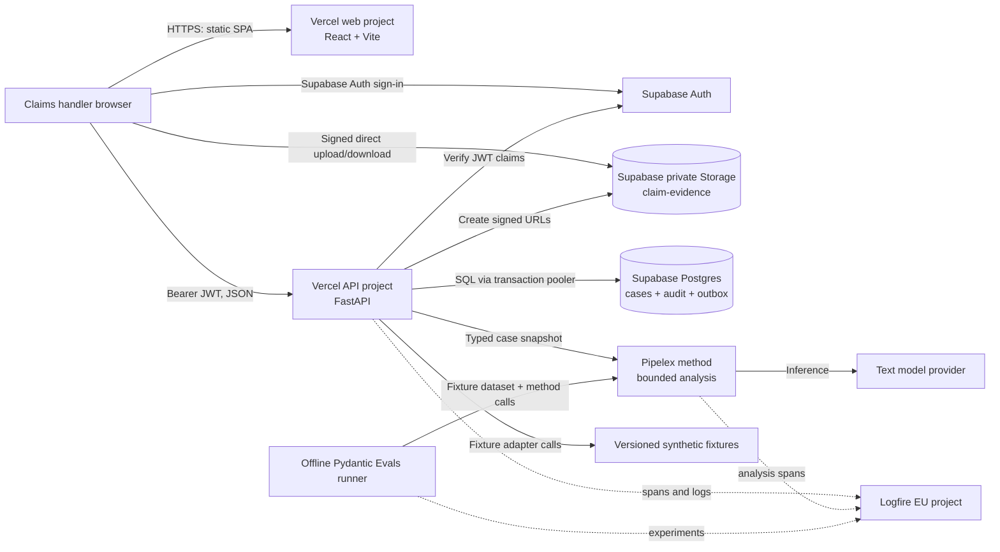

# Hackathon architecture: cross-border motor claim

Status: proposed implementation specification, 25 September 2026. This refines the [target workflow](sequence-diagram.md). All cases and media in the hackathon demo are synthetic. No external claim, CCTV request, insurer registration, or email is sent.

## Decisions

| Concern | Decision for the demo | Reason |
| --- | --- | --- |
| Hosting | Two Vercel projects from this monorepo: static React/Vite web and Python FastAPI API | Each project has a simple, documented build root; the browser calls the API over HTTPS. |
| State and files | One Supabase project: Auth, Postgres, private Storage bucket | Durable case state and evidence without a worker or local disk. |
| AI | One bounded Pipelex method, run synchronously by FastAPI, using a configured text model | Gives a real AI step; all provider outputs enter the same typed case contract. |
| Other services | Fixture adapters for voice, vision, Camérci/CCTV, insurer lookup, BCF, insurer SI, and send | Deterministic demo with explicit mock labels. Dust is omitted until a real need for its separate agent/corpus is established. |
| Observability | Logfire EU project for API and analysis traces; Pydantic Evals for offline fixture experiments | See latency, failures, model behavior, and changes across prompt versions. |
| User access | One invite-only Supabase Auth handler account | Protects the public API and model key without building a role system. |
| Asynchronous events | A visible “receive CCTV” demo action | Demonstrates the waiting state without a queue or webhook. |

### Platform constraints shaping the design

Vercel supports FastAPI as a Python Function, currently with Python 3.12 as its default. A Python Function has a 500 MB uncompressed bundle limit, and a Function request or response body has a 4.5 MB limit. Evidence therefore goes directly from the browser to Supabase Storage through a short-lived signed upload; FastAPI receives metadata only. Vercel functions are request-scoped, so the demo does not depend on an in-memory queue or background task. Pipelex direct execution runs in-process; one short analysis method is suitable for this cut. If its Vercel bundle or latency proves unsuitable, only the analysis adapter changes to the hosted Pipelex API.

## Deployment and component connections



**Browser → API.** The web app uses Supabase Auth only for login and signed Storage transfers. All case reads and writes go through FastAPI, which verifies the user's JWT and returns versioned JSON. The web app never holds a database password, Storage secret key, model key, or Logfire write token.

**API → Postgres.** Postgres is the source of truth for the case, evidence metadata, observations, analysis runs, drafts, approvals, and simulated actions. A request opens a short transaction through Supabase's transaction pooler. Case tables have Row Level Security enabled and no browser role policies; only the authenticated FastAPI path writes them. No state is authoritative in a Vercel Function's memory.

**API → Storage.** The API creates a case-scoped object path and signed upload. The browser uploads the binary to the private bucket, then tells the API the path, size, media type, and client-computed checksum. The API verifies the object exists and checks its metadata before recording an immutable evidence row; the checksum is marked client-declared until independently verified. Seeded fixture files may carry a preverified checksum. The API signs short-lived read URLs for the handler UI.

**API → Pipelex.** The application assembles a bounded, typed snapshot of caller statements, evidence observations, mock lookup results, and source IDs. Pipelex returns a typed proposed brief and claims. The application validates those claims and applies deterministic gates before any draft becomes reviewable. Pipelex does not own case status, approvals, or simulated sends.

**API → fixtures.** Each external adapter implements the same interface expected of a future live provider. Fixture responses include `provider`, `mode=mock`, source reference, timestamp, and explicit `matched` / `no_match` / `unavailable` / `ambiguous` status. The demo UI labels these results as simulated.

**API/evals → Logfire.** One trace follows each API request. Child spans cover database work, fixture adapter calls, Pipelex inference, gate decisions, and simulated actions. A separate offline runner sends evaluation experiments to the same project with a distinct service name. Synthetic case content may be logged, but binary evidence and credentials are never trace attributes.

## Infrastructure sequence: seeded case through simulated send

```mermaid
sequenceDiagram
    autonumber
    actor Handler
    participant Web as Vercel web / browser
    participant Auth as Supabase Auth
    participant API as Vercel FastAPI Function
    participant DB as Supabase Postgres
    participant Storage as Supabase private Storage
    participant Fixtures as Fixture adapters
    participant Pipelex as Pipelex in API process
    participant Model as Text model provider
    participant Logfire as Logfire EU

    Handler->>Web: Open demo and sign in
    Web->>Auth: Email/password login
    Auth-->>Web: Short-lived access JWT
    Handler->>Web: Create synthetic scenario
    Web->>API: POST /v1/cases + Bearer JWT + scenario_id
    API->>Auth: Verify JWT claims
    API->>Logfire: Start case.create trace (case ID, no secrets)
    API->>Fixtures: Load versioned intake and mock outputs
    API->>DB: Transaction: insert case + intake + audit event
    DB-->>API: Case ID, state_version=1, content_revision=1
    API-->>Web: CaseView + ETag/state_version

    Handler->>Web: Add synthetic photo
    Web->>API: POST /v1/cases/{id}/evidence/upload-intents
    API->>Storage: Sign upload for case-scoped path
    Storage-->>API: Signed upload token/path
    API-->>Web: UploadIntent
    Web->>Storage: Upload binary directly
    Storage-->>Web: Upload result
    Web->>API: POST /v1/cases/{id}/evidence (path, checksum, expected version)
    API->>Storage: Check object metadata
    API->>DB: Transaction: add evidence + increment content revision
    API-->>Web: Updated CaseView

    Handler->>Web: Simulate CCTV receipt
    Web->>API: POST /v1/cases/{id}/demo-events/cctv-received
    API->>Fixtures: Resolve CCTV fixture and observations
    API->>DB: Transaction: append evidence/event + increment revision
    API-->>Web: Updated CaseView, all mock results labelled

    Handler->>Web: Run analysis
    Web->>API: POST /v1/cases/{id}/analysis-runs (expected version)
    API->>Fixtures: Mock vision, coverage, and correspondent lookups
    API->>DB: Persist changed provider results; read snapshot at content_revision=N; record run
    API->>Pipelex: Execute bounded method with typed snapshot
    Pipelex->>Model: Text inference
    Model-->>Pipelex: Structured proposal
    Pipelex-->>API: AnalysisOutput + source references
    API->>API: Validate schema, source IDs, contradictions, gates 1-3
    API->>DB: Transaction: store run/draft only if content_revision=N
    API->>Logfire: Record model/gate spans and run outcome
    API-->>Web: AnalysisRun + current CaseView (or stale/failed result)

    Handler->>Web: Review and edit draft
    Web->>API: PATCH /v1/cases/{id}/drafts/current + expected version
    API->>DB: Create immutable draft version; invalidate prior approval
    API-->>Web: New draft ID, digest, content revision
    Handler->>Web: Approve exact draft
    Web->>API: POST /v1/cases/{id}/approvals (draft ID, expected version)
    API->>API: Recheck gates and current draft/content revision
    API->>DB: Transaction: record handler, draft ID, digest, revision
    API-->>Web: Approval ID
    Handler->>Web: Register and send (simulation)
    Web->>API: POST /v1/cases/{id}/registration then /send + idempotency keys
    API->>DB: Recheck approval; write unique simulated references to outbox/audit
    API->>Logfire: Record approved mock actions
    API-->>Web: SIM-CLAIM and SIM-MSG receipts; no external message
```

Provider results are cached by case, query, provider, and fixture version; an identical rerun does not change the case revision. The analysis request has an application timeout shorter than the Vercel Function limit. If it fails, the run is recorded as failed when possible and may be rerun; no approval or simulated send happens automatically. If the case changes during inference, the result is marked stale and cannot replace the current draft. The handler can then rerun analysis on the new revision.

## Proposed repository structure

```text
apps/
  api/                         # Vercel project root: Python 3.12, FastAPI
    app.py                     # Vercel ASGI entrypoint
    pyproject.toml
    uv.lock
    claim_api/
      main.py                  # App wiring, CORS, Logfire, auth dependency
      routes/                  # Versioned HTTP endpoints only
      contracts/               # Pydantic API and provider result models
      domain/                  # Case transitions, gates, approval rules
      services/                # Use cases: intake, evidence, analysis, review
      adapters/                # DB, Storage, Pipelex, fixture providers
      migrations/              # Alembic revisions and referenced SQL schema
      methods/                 # Versioned Pipelex .mthds bundles
    .pipelex/                 # Tracked, non-secret runtime/model configuration
    fixtures/                 # Small JSON fixtures bundled with the API
  web/                         # Vercel project root: React/Vite/TypeScript
    package.json
    package-lock.json
    src/
      api/                     # Generated OpenAPI types/client + fetch wrapper
      auth/                    # Supabase Auth session and route guard
      features/                # Case timeline, evidence, analysis, review
      components/              # Shared presentation components
evals/
  datasets/                    # Golden synthetic cases and expectations
  run.py                       # Pydantic Evals experiment entrypoint
docs/
  architecture.md              # This specification
  contracts.md                 # API, domain, and adapter contracts
  erd.md                       # Supabase Postgres entity relationships
  sequence-diagram.md          # Full target workflow
```

One monorepo keeps fixture IDs, API schemas, Alembic migrations, and method versions aligned. Vercel links `apps/web` and `apps/api` as separate projects. Runtime fixtures live inside `apps/api` so they are included when Vercel builds that project root; large synthetic media lives in Supabase Storage. Local development uses Vite plus Uvicorn against the same Supabase project or a separate development project; no Docker is required for the demo.

## Technical specification

| Layer | Choice | Configuration / limit |
| --- | --- | --- |
| Web | React, Vite, TypeScript in strict mode | Static Vercel build; fetches FastAPI with a Supabase access token. |
| API | Python 3.12, FastAPI, Pydantic v2 | One Vercel Function; OpenAPI is the source for generated TypeScript request/response types. |
| Database | Supabase Postgres; psycopg 3 and explicit SQL | Use transaction pooler URL, TLS, short connections, no prepared statements in transaction mode. SQL migrations own schema. |
| Storage | Private `claim-evidence` bucket | Signed direct upload and short-lived read URLs; no evidence bytes through FastAPI. Bucket limits allowed MIME types and file sizes. |
| Auth | Supabase Auth, one invited handler | Frontend obtains JWT; API verifies signature/claims; public signup disabled. |
| AI | Pipelex local direct execution, one text method | Pinned package and method configuration; one model key in API environment. Fixture providers remain independent. |
| Telemetry | Logfire Python SDK in EU region | Instrument FastAPI and custom spans; token server-side. |
| Evals | Pydantic Evals plus Logfire experiments | Run offline on fixture dataset, not on every API request. |

`apps/web` public environment: `VITE_API_BASE_URL`, `VITE_SUPABASE_URL`, `VITE_SUPABASE_PUBLISHABLE_KEY`. `apps/api` secret environment: `DATABASE_URL`, `SUPABASE_URL`, `SUPABASE_PUBLISHABLE_KEY`, `SUPABASE_SECRET_KEY`, model provider key, `LOGFIRE_TOKEN`, and `WEB_ORIGIN`. The API also has `DEMO_MODE=true`; mock-only endpoints reject requests when it is false. Commit examples and lockfiles, never credentials.

## Logfire and evaluation plan

The private EU Logfire project [claim-subrogation-demo](https://logfire-eu.pydantic.dev/benjamin-derre78/claim-subrogation-demo) is created. Set API service name `claims-api` and offline evaluation service name `claims-evals`. Trace attributes: `case_id`, `content_revision`, `analysis_run_id`, `step`, `adapter`, `mode`, `gate`, `outcome`, latency, and model usage. Logfire's FastAPI instrumentation may capture parsed arguments, so configure scrubbing and limit request attributes even though the seeded cases are synthetic. Create a write token when wiring the API and keep it only in local/Vercel secrets; no Logfire token goes to browser code.

The offline dataset starts with five cases: complete claim, ambiguous plate, missing CCTV, contradictory date, and unsupported liability claim. Pydantic Evals runs the Pipelex analysis against each case. Deterministic evaluators require zero invalid source IDs, zero unlabelled unsupported claims, and no positive insurance match from an ambiguous plate. They also check schema validity, missing-item detection, and draft structure. A reviewed evaluator checks whether the prose distinguishes observations, caller reports, and hypotheses. Logfire compares experiment runs for quality, latency, and cost. Runtime gates remain code checks; eval scores never authorize a send.

## First implementation slices

1. Deploy a minimal FastAPI endpoint that imports Pipelex and emits a Logfire span from Vercel. This settles the Python bundle/startup risk before UI work grows.
2. Create Supabase schema, private bucket, one handler account, and synthetic seed case.
3. Build the case timeline and review UI against fixture-backed endpoints.
4. Add the live Pipelex method, source validation, gates, and immutable draft approval.
5. Add direct evidence upload, simulated CCTV, registration, and outbox send; run the offline eval dataset.

## Primary platform references

- [Vercel FastAPI deployment](https://vercel.com/docs/frameworks/backend/fastapi), [Python runtime](https://vercel.com/docs/functions/runtimes/python), and [Function limits](https://vercel.com/docs/functions/limitations).
- [Supabase serverless database connections](https://supabase.com/docs/guides/database/connecting-to-postgres), [private Storage](https://supabase.com/docs/guides/storage/buckets/fundamentals), [signed uploads](https://supabase.com/docs/reference/python/storage-from-createsigneduploadurl), and [JWT verification](https://supabase.com/docs/guides/auth/jwts).
- [Pipelex Python execution](https://docs.pipelex.com/latest/building-methods/pipes/executing-pipelines/) and [direct versus durable execution](https://docs.pipelex.com/latest/features/distributed-execution/).
- [Logfire FastAPI instrumentation](https://pydantic.dev/docs/logfire/integrations/web-frameworks/fastapi/), [scrubbing](https://pydantic.dev/docs/logfire/instrument/scrubbing/), and [datasets and experiments](https://pydantic.dev/docs/logfire/evaluate/datasets-and-experiments/).
