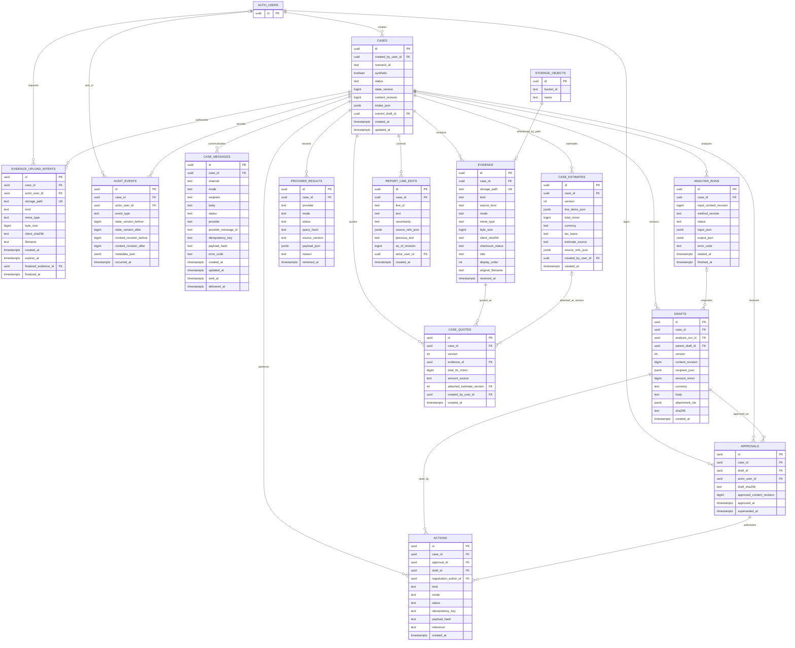

# Hackathon case data model

This ERD is the physical model implemented by the Alembic revision and SQL resource under `apps/api/claim_api/migrations`. Alembic is the schema migration source of truth for Supabase Postgres. It implements the [case and adapter contracts](contracts.md) while keeping the hackathon schema small. Table names in the diagram are uppercase for readability; SQL names are lowercase. `AUTH_USERS` and `STORAGE_OBJECTS` are managed by Supabase.

## Ownership and relationship details

| Relationship | Enforcement |
| --- | --- |
| Case → evidence, provider results, analysis runs, drafts, approvals, actions, audit events | SQL foreign key on `case_id`. |
| Handler → case/approval/audit event | UUID references Supabase `auth.users.id`; `audit_events.actor_user_id` may be null for a system event. |
| Storage object → evidence | **Logical link only** through `(bucket_id='claim-evidence', storage_path=name)`. Supabase owns `storage.objects`; the API checks object existence when finalizing evidence. |
| Analysis run → draft | Nullable `analysis_run_id`; a handler edit also sets `parent_draft_id` to the draft it revised. |
| Draft → approval → action | SQL foreign keys plus application checks that all records belong to the same case and that the approval matches the current content revision and draft digest. |
| Registration action → send action | Nullable `actions.registration_action_id` on a send receipt; the API requires a confirmed registration before a simulated send. |
| Case → current draft | Nullable `cases.current_draft_id`, updated transactionally with draft creation. It must refer to a draft of the same case. |

`intake_json`, provider payloads, analysis input/output, and draft attachment IDs are JSONB because their demo shapes will evolve quickly. They are validated by Pydantic before writes. Source references inside analysis output point to evidence or provider-result UUIDs, and attachment IDs point to evidence UUIDs; the API checks their existence and case ownership because JSONB does not provide row-level foreign keys for array elements. A later pilot can normalize these into proposition, source-reference, and draft-attachment tables if query needs justify it.

Logfire traces and evaluation experiments are held in Logfire, not in these case tables. Synthetic fixture definitions and golden eval cases are versioned in the repo. `analysis_runs.method_version` and `provider_results.source_version` make each stored output reproducible.

## Migration constraints and indexes

- Primary keys are UUIDs; `created_at`, `received_at`, `retrieved_at`, and `occurred_at` default to UTC server time. Required status/mode fields have SQL `CHECK` constraints matching the contract enums.
- `cases.state_version` and `cases.content_revision` are nonnegative. Mutations use `UPDATE ... WHERE id = ? AND state_version = ?` inside a transaction, then append one audit event.
- `evidence.storage_path` is unique; the private bucket path is prefixed by case ID. `client_sha256` remains explicitly unverified until `checksum_status='verified'`.
- `evidence_upload_intents` binds a two-hour, non-upsert Storage token to its handler, case, generated path, and declared metadata. It has RLS enabled and no browser policies; finalization records its evidence ID and timestamp once.
- `provider_results` has a unique constraint on `(case_id, provider, mode, query_hash, source_version)`. For fixtures, `source_version` is the fixture version; for live adapters it is an explicit provider/config version. This prevents an identical lookup from incrementing the case revision again.
- `drafts` has a unique constraint on `(case_id, version)`. `approvals` has at most one unsuperseded row per case through a partial unique index on `case_id WHERE superseded_at IS NULL`.
- `actions` has a unique constraint on `(case_id, kind, idempotency_key)` and stores a `payload_hash`. Repeating the same key and payload returns the existing receipt; a different payload with that key is a conflict.
- Index `(case_id, started_at DESC)` on analysis runs, `(case_id, version DESC)` on drafts, and `(case_id, occurred_at)` on audit events for the handler timeline.
- Enable Row Level Security on all application tables, with no `anon` or `authenticated` browser policies. The API alone uses its server-side database credential after verifying the handler JWT. The Storage bucket remains private.

The Alembic revision applies tables and constraints in dependency order, then adds the nullable `cases.current_draft_id` foreign key after `drafts` exists. No database cascade should erase audit events, approvals, or action receipts when editing case content.

## Follow-up SMS storage

Migration `20260925_case_messages` adds `case_messages` after the evidence upload intents revision, which follows the core revision. A message belongs to a case, without any draft or approval dependency. `actions` remains exclusively for approved claim registration/send.

- `channel=sms`; `mode=mock|live` distinguishes preview/simulation from provider delivery. Adding storage does not enable real SMS sending.
- `recipient` uses E.164 form; `body` is the exact message snapshot, not a dynamically regenerated case summary. The sender must treat recipient/body/payload hash as immutable after creation.
- Statuses: `queued` (local intent), `accepted` (provider accepted request, not proof of delivery), `sent`, `delivered`, `failed`, `unknown` (uncertain submission/delivery outcome). `sent_at` is required for `sent`; delivery requires ordered `sent_at` and `delivered_at`. Callback processing must tolerate out-of-order events and not regress delivered status.
- A unique `(case_id, channel, idempotency_key)` identifies one logical send. The application must compare `payload_hash` over canonical channel/mode/provider/recipient/body: same key and payload returns the existing message, different payload returns a conflict. A uniqueness constraint alone does not guarantee exactly-once delivery to an external provider. Reconcile an unknown outcome before any retry.
- Provider IDs are unique per provider and mode when present. `provider` is a stable adapter/account namespace. Store provider error codes in `error_code`, not raw responses containing secrets.
- The API must update `updated_at` and append an audit event transactionally on changes; SQL does not add an automatic timestamp trigger. Message-only writes increment case `state_version`, not `content_revision`, so delivery updates do not invalidate claim approvals. Actual intake/evidence changes still do.
- Keep message text and upload links out of audit/log metadata; record message UUID and status instead. Case-scoped upload links must retain their expiration/access checks even though the historical body is persisted.
- RLS is enabled with no browser policies; the API is the access path. Case deletion is restricted while messages exist. `(case_id, created_at DESC, id DESC)` supports the timeline.

This migration adds storage only. Message creation/send APIs, the SMS provider adapter, authenticated delivery callbacks, and retry/reconciliation logic remain to be implemented.
