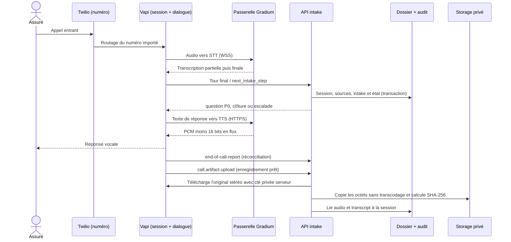

# S08 — Appel entrant et intake sourcé (Twilio, Vapi, Gradium)

**Statut : contrat d'implémentation.** Cette tranche introduit l'appel et le triage ; S09 prend en charge le SMS et S10 le dépôt de pièces. Aucun fournisseur voix n'est actuellement branché à l'API du projet. Le parcours peut être rejoué sans réseau avec des transcriptions synthétiques.

## Résultat attendu

Un appel entrant sur un numéro Twilio ouvre une session Vapi. Vapi orchestre le dialogue et le modèle de langage ; un service passerelle relie Vapi à Gradium pour la transcription (STT) et la voix (TTS). Notre API détient la logique métier du triage, la provenance des déclarations et l'écriture du dossier. L'identifiant de l'appel Vapi sert de `session_id` stable. L'appelant reçoit au plus les questions P0 utiles, une par une. Un cas urgent sort du parcours automatique et apparaît dans l'interface gestionnaire. La bande son complète originale est conservée dans un bucket privé et le transcript segmenté est consultable dans le dossier, avec lecture audio autorisée.

## Répartition des responsabilités

| Élément | Responsabilité et configuration |
| --- | --- |
| Twilio | Numéro de démonstration entrant, importé dans Vapi avec ses identifiants Twilio. Affecter un assistant Vapi enregistré au numéro. Désactiver la gestion SMS de Vapi sur ce numéro si S09 envoie directement par Twilio, afin d'éviter deux webhooks SMS concurrents. Aucun appel sortant dans S08. |
| Vapi | Création de la session, dialogue, modèle de langage, outils et événements serveur. Activer `artifactPlan.recordingEnabled` et un enregistrement stéréo WAV pour conserver les canaux appelant/assistant, ainsi que la transcription. Utiliser un assistant **enregistré et versionné**, avec un `server` authentifié ; aucune URL de webhook fournie par un assistant éphémère. Le prompt guide la formulation, mais les décisions P0 et l'écriture du dossier appartiennent à l'API. |
| Passerelle Gradium | Service accessible en HTTPS/WSS depuis Vapi, séparé de l'API métier ou isolé dans un module dédié. `custom-transcriber` reçoit l'audio et renvoie les transcriptions `partial`/`final` du seul canal appelant. `custom-voice` convertit les réponses en PCM brut mono 16 bits little-endian au `message.sampleRate` demandé. Clés Gradium uniquement côté serveur. Langue STT `fr` pour la démo. |
| API intake | Valide la provenance des événements, résout `call_id → case_id`, extrait les déclarations sourcées, choisit `ask`, `complete` ou `urgent_human_handoff`, et persiste session/intake/audit dans une transaction. Après disponibilité de l'artefact, copie l'enregistrement original dans Storage privé et sert sa lecture par URL signée courte à l'utilisateur autorisé. Elle n'envoie ni SMS ni demande de preuve dans S08. |

La [documentation Vapi d'import Twilio](https://docs.vapi.ai/phone-numbers/import-twilio), le [guide Gradium pour Vapi](https://docs.gradium.ai/integrations/agent-frameworks/vapi), les contrats Vapi [custom STT](https://docs.vapi.ai/customization/custom-transcriber/gradium) et [custom TTS](https://docs.vapi.ai/customization/custom-tts/gradium) fondent ce câblage. Gradium n'est pas un fournisseur natif à sélectionner dans l'assistant Vapi : les deux endpoints de la passerelle sont requis si Gradium fournit à la fois STT et TTS.

## Contrats et persistance

Définir `IntakeSourceV1` en entrée de l'extracteur avec :

- `schema_version=1`, `provider="vapi"`, `mode=mock|live`, `session_id` (ID d'appel Vapi), `call_started_at` UTC issu de l'événement serveur, `scenario_id` seulement pour un scénario synthétique ;
- les segments **finaux** ordonnés `{segment_id, speaker, start_ms, end_ms, text}` ; les partiels servent à l'interruption vocale et ne sont pas persistés comme faits ;
- `assistant_version`, `extractor_version`, `source_event_key` et `received_at` pour le rejeu et l'audit ; le numéro appelant et les arguments générés par le LLM ne prouvent pas l'identité assurée.

La sortie `IntakeExtractionV1` contient, pour chaque champ candidat, `{value|null, source_segment_ids, transcript_excerpt, uncertainty}` ; pour l'heure d'accident, ajouter `time_source=caller_statement|inferred_from_call|unknown`. `unknown` se projette en `incident_at=null` et `Intake.time_source=null` dans le modèle actuel. `inferred_from_call` se projette tel quel ; `caller_statement` conserve la valeur annoncée, sans la transformer en observation. Ajouter `missing_fields`, `triage_status=collecting|complete|urgent_human_handoff`, `triage_reason`, `next_question` et `mode` à la décision. Les références doivent pointer vers des segments de cette session ; rejeter une extraction qui cite un segment absent. Conserver le texte exact du segment utile comme source et afficher « déclaré par l'appelant ».

P0 à recueillir pendant l'appel : récit, lieu, prénom et nom de l'appelant uniquement. La date et l'heure de l'accident ne sont pas demandées pendant l'appel et ne bloquent pas sa clôture. L'implication d'un autre véhicule, la présence du tiers, le danger actuel et les blessures ne sont ni demandés ni bloquants pour compléter l'appel. Les déclarations spontanées restent conservées ; un danger immédiat ou une blessure grave spontanément signalés déclenchent toujours une prise en charge humaine. L'API ne substitue jamais `no` à `unknown`. L'heure de début d'appel ne vaut heure d'accident estimée que si l'appelant dit explicitement que l'accident vient de se produire ; « ce matin » reste une information spontanée à sourcer, sans question de suivi pendant l’appel. Si l'appelant a déjà dit que sa voiture était à l'arrêt, ne pas redemander son mouvement. La référence de police peut rester manquante à la création du dossier et maintient la gate intake existante ouverte. P1 (plaque, modèle, couleur, dégâts détaillés) reste facultatif pour S08 et sera demandé ou recherché par S09/S10/S12.

Persister une session unique par `(provider, session_id)` avec `case_id`, état et versions. Une clé d'événement stable est unique par session (ID fournisseur si fourni, sinon type + identifiant/ordre du segment final + empreinte du payload canonique). La répétition du même événement retourne le même résultat ; un événement de fin tardif complète la même session. Un segment corrigé/remplacé ne peut effacer silencieusement une déclaration déjà utilisée : il crée une révision sourcée. Incrémenter `state_version`/`content_revision` uniquement quand le contenu matériel change ; écrire l'audit dans la même transaction. Une session ne peut appartenir à deux dossiers, et un dossier urgent ne peut progresser automatiquement vers S09/S10/analyse.

Conserver **tous les segments finaux** du transcript, appelant et assistant, dans leur ordre et avec `speaker`, offsets temporels et texte ; l'UI les présente comme transcription de l'appel, distincte des champs structurés. Un segment manquant ou une transcription partielle ne s'affiche pas comme une phrase définitive. L'audio est une entité liée à `session_id`/`case_id` avec `status=pending|available|error`, type MIME réel, nombre d'octets, SHA-256 serveur, chemin privé et date de récupération. À réception de `call.artifact.upload` ou par reprise après `end-of-call-report`, un worker utilise la clé Vapi privée sur `GET /call/{id}/stereo-recording`, suit le redirect court **côté serveur**, copie les octets sans transcodage dans Storage privé puis marque `available` après vérification. Un rejeu de l'événement ne crée pas de second objet. Ne jamais persister ni exposer l'URL Vapi temporaire au navigateur ; la lecture passe par un accès au dossier puis une URL Storage signée courte. Si l'artefact n'est pas prêt, l'UI indique « enregistrement en attente » ; si la récupération échoue, elle montre l'erreur sans faire disparaître le transcript.

Le dossier existant reste le read model : `Intake.reported_at` est l'heure de déclaration, `incident_at` et `time_source` conservent l'incertitude ; `danger_status` et `injury_status` gardent `yes|no|unknown`. Ajouter le statut d'urgence/la gravité dans une structure explicite et visible plutôt que de déduire une urgence d'un simple `injury_status=yes` (une blessure légère n'est pas nécessairement grave). Les corrections ultérieures du gestionnaire sont `handler_entered` et conservent la déclaration vocale d'origine dans la piste d'audit.

## Dialogue et transitions

1. Au début de l'appel, Vapi dit : « Bonjour, comment puis-je vous aider ? » La première réponse libre est analysée avant toute question.
2. Après chaque tour final de l'appelant, Vapi appelle l'outil `next_intake_step`. Le `call_id` provient du contexte serveur Vapi ou d'un paramètre statique de l'outil, jamais d'un argument que le modèle peut écrire. L'API recoupe les arguments candidats avec les segments finaux reçus par webhook ; elle ne fait pas confiance à une valeur que le modèle a ajoutée sans source. La réponse de l'outil est `{decision, next_question, missing_fields, case_id}`. Si le webhook final arrive après l'outil, répondre `pending_source` sans écriture matérielle, attendre brièvement puis réessayer une seule fois ; si la source manque toujours, garder la session incomplète. Vapi prononce uniquement le texte retourné par l'API.
3. `urgent_human_handoff` a priorité sur toute question ou clôture. Si danger immédiat ou blessure grave est signalé, arrêter les questions documentaires, annoncer l'orientation vers les secours et l'interlocuteur humain, créer l'alerte visible avec le contexte disponible. Le transfert téléphonique réel n'est tenté que vers un numéro humain configuré ; si indisponible, dire explicitement qu'il n'y a pas de transfert et laisser l'alerte ouverte.
4. Sinon, poser **une** question P0 manquante à la fois, en n'interrogeant pas de nouveau un fait déjà déclaré. Si les P0 sont suffisants, confirmer seulement le suivi à venir et clôturer. La cible de 15–20 secondes concerne le récit complet, pas les appels incomplets ou urgents.
5. Le `end-of-call-report` Vapi réconcilie les segments finaux et l'état. Une coupure, un échec d'outil ou un transcript absent laisse la session `incomplete`/`error`, visible dans l'UI ; aucun SMS ni progression automatique n'est déclenché sur une clôture supposée.

## Authentification, données et exploitation

- Configurer des *Custom Credentials* distincts pour les webhooks métier et la passerelle Gradium ; vérifier le secret/HMAC à l'entrée HTTPS et lors du handshake WSS. Vapi documente que les credentials d'organisation peuvent être omis pour une URL fournie par un assistant éphémère, d'où l'assistant enregistré. Le jeton API Vapi, l'Auth Token Twilio et la clé Gradium restent dans les secrets serveur, jamais dans le navigateur, les prompts, le dépôt ou Logfire.
- Limiter les événements métier abonnés à ceux nécessaires : transcriptions finales, état, `end-of-call-report` et `call.artifact.upload`. Les événements partiels restent transitoires côté passerelle/Vapi. Vérifier `call_id`, assistant et environnement attendus ; journaliser des identifiants techniques, versions, latences, `decision`, statut et erreurs sans texte de transcript, numéro complet ni audio.
- Garder audio et transcript privés, accessibles au seul gestionnaire autorisé ; ne pas les envoyer dans Logfire. Annoncer l'enregistrement dans le parcours d'appel et paramétrer explicitement la conservation des deux copies, chez Vapi et dans Storage, avant un pilote avec de vrais appelants.
- Fournir un mode `mock` déterministe sans credentials, un mode `live` activé par configuration explicite, et un `request_id` corrélable entre webhook, session, dossier et trace. Aucune simulation ne doit être étiquetée `live`.

## Recette de S08

| Cas | Entrée synthétique | Attendu |
| --- | --- | --- |
| A01 | Récit, lieu, prénom et nom complets | Intake sourcé, aucune question redondante, session `complete`. |
| A02 | « Je viens d'avoir un accident » et début d'appel connu | Heure spontanée sourcée ; aucune question sur l’heure. |
| A03 | « Ce matin » sans heure | Pas de question sur l’heure ; demander le prénom et le nom si absents. |
| A04 | Lieu absent mais autres P0 donnés | Une question sur le lieu, sans plaque P1. |
| A05 | Danger immédiat ou blessure grave | `urgent_human_handoff`, alerte UI et aucune suite S09/S10. |
| A06 | L'appelant ignore l'état du tiers ou les blessures | `unknown` et `missing_fields` conservés, aucune négation inventée. |
| A07 | Même `session_id`, transcript et webhook rejoués / livrés dans le désordre | Un seul dossier, une seule version matérielle par changement et aucun audit dupliqué. |
| A08 | Coupure, outil indisponible ou `end-of-call-report` sans transcript | Session incomplète/erreur, reprise humaine possible, pas de suite automatique. |
| A09 | Enregistrement stéréo Vapi disponible après fin d'appel | Octets WAV originaux copiés une seule fois en Storage privé, SHA-256/format/taille enregistrés, transcript final et lecture audio visibles au gestionnaire autorisé. |
| A10 | Artefact audio absent, retardé ou récupération échouée | Statut `pending`/`error` visible ; transcript conservé ; aucun lien public ni faux état « disponible ». |

Tester l'extraction et le triage sur ces transcriptions synthétiques, puis tester les payloads Vapi simulés, la passerelle Gradium avec flux audio factice et les retries. Les appels réels de qualification sont une étape d'exploitation distincte ; aucun test CI n'utilise Twilio, Vapi ou Gradium. Les vidéos V01–V06 du [parcours jury](../jury-path.md) sont des cas de preuve aval, pas des fixtures de transcription S08.

## Références fournisseur

- [Vapi : numéro Twilio importé](https://docs.vapi.ai/phone-numbers/import-twilio) et [gestion SMS du numéro](https://docs.vapi.ai/phone-numbers/inbound-sms/)
- [Gradium : intégration Vapi STT/TTS](https://docs.gradium.ai/integrations/agent-frameworks/vapi)
- [Vapi : custom transcriber](https://docs.vapi.ai/customization/custom-transcriber) et [custom TTS](https://docs.vapi.ai/customization/custom-voices/custom-tts)
- [Vapi : événements serveur](https://docs.vapi.ai/server-url) et [authentification des webhooks](https://docs.vapi.ai/server-url/server-authentication)
- [Vapi : enregistrement et transcript](https://docs.vapi.ai/assistants/call-recording) et [récupération authentifiée de l'audio](https://docs.vapi.ai/assistants/retrieve-call-artifacts)
